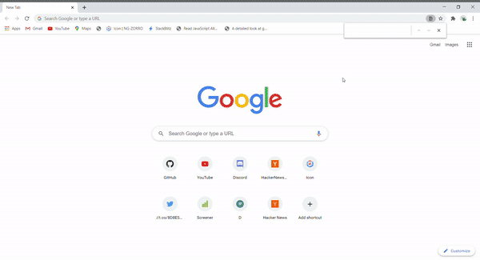

# HackerNewsClone

## Live Demo

You can check out the demo here -- [Demo](https://wonderful-hermann-fed536.netlify.app/)

## Preview 

 
## Screenshots

### Status

- [x] Build posts section 
- [x] Build recursive comment section 
- [ ] Add pagination  

### Development server

Run `ng serve` for a dev server. Navigate to `http://localhost:4200/`.

